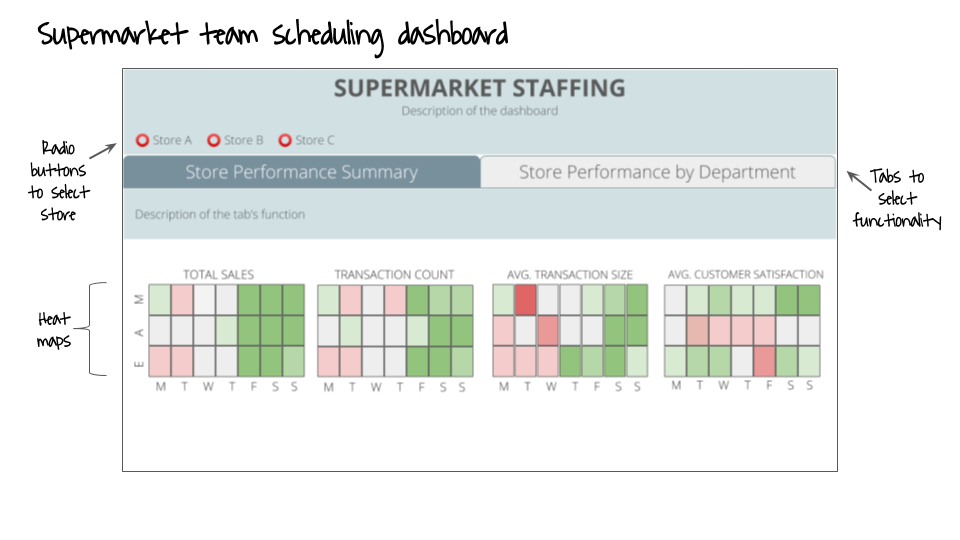
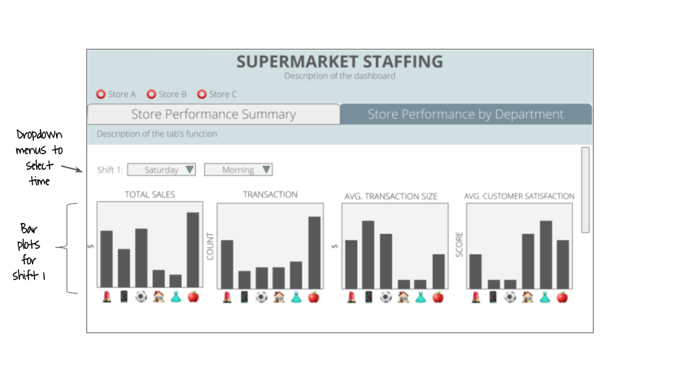
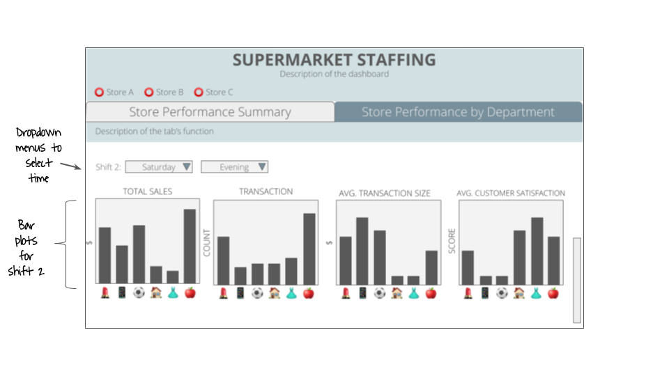

# DSCI_532_group-106_R_supermarket
An R dashboard by Reiko Okamoto, Haoyu Su and Monique Wong

[Link to our app](https://dsci-milestone4-test.herokuapp.com/)

## Description

The dashboard consists of a landing page (default tab: *Supermarket Performance Summary*) that shows four heat maps showing total sales, transaction count, average transaction size and average customer satisfaction. Using radio buttons, the user can toggle between different stores and select which one to analyze. The user can compare the values of the above variables across business hours and decide on the specific day of the week and/or the time of day to further explore. The user can then switch to the *Compare Store Performance By Department* tab and use the drop-down menus to select the day of the week (Monday through Sunday) and/or time of day (morning, afternoon or evening). After the selection, the user will be able to see four bar plots that can be used to compare total sales, transaction count, average transaction size, and average customer satisfaction across the product lines (i.e. departments in the supermarket) during the specified time. Moreover, the user can compare the store performance at one point in the week to that of another. They can use another set of drop-down menus to make their new selection. Making this selection will render a second set of bar plots in the dashboard.

## Sketch

The *Store Performance Summary* tab is selected showing the heat maps.

The *Store Performance by Department* tab is selected showing the bar plots for the selected day and time.

Scroll down to select a different day and/or time and render another set of bar plots for comparison.

